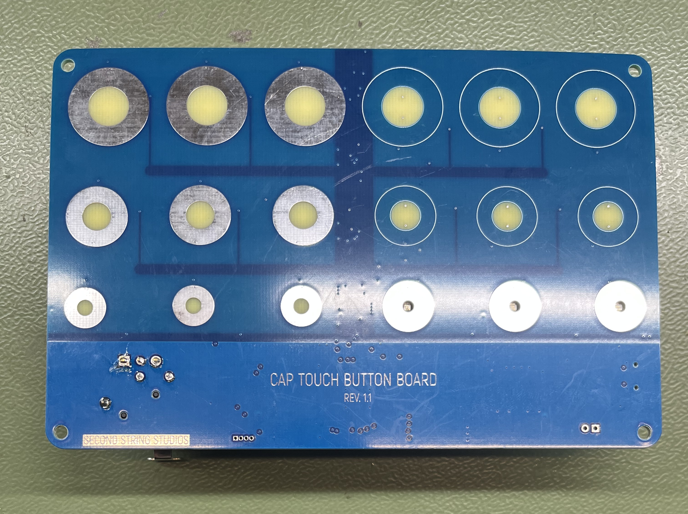
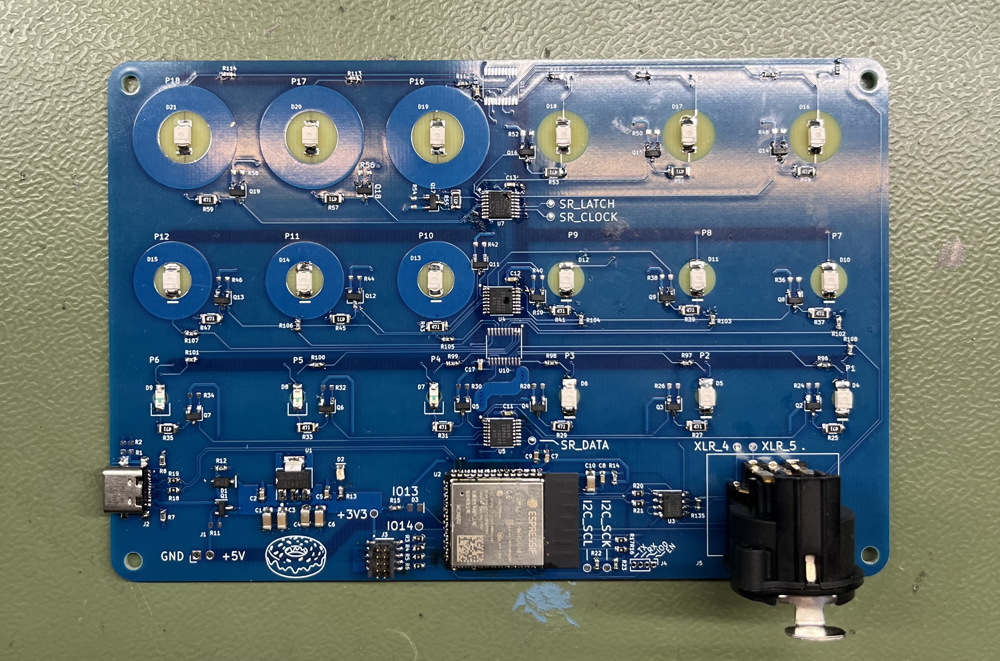

# capacitive-touch-button-board-prototype

This repo contains two designs for prototype PCBs for testing different capacitive touch button styles and different reverse-mounted LED colors and styles. While version 1.1 was indeed fabbed, built, and works, these files are made public only for reference. **Do not expect to build these designs with no changes and have everything working for you**.

Version 1.0 is the full 6x6 version of the board. It all fabrication outputs were generated, but the board was never fabbed due to cost.
Version 1.1 is the same as 1.0 but with the top 3 rows of buttons removed to simplify the design physical size and part cost.   

There is a schematic PDF and PCB layer prints PDF in the version 1.1 directory if you do not have KiCad. Version 1.1 that was built also contains generated Excel and interactive boms in its main directory or the `bom/` directory.

Find the custom capacitive touch footprints in the `symbols_and_footprints/` directory of each hardware version.

There is test firmware for version 1.1 in `button-board_rev_1_1/bringup_firmware/`. **NOTE:** This firmware is sloppy, terribly written, inefficient, and everything is hardcoded. It is only included as a reference, do not think that this will work for you out of the box.

Videos of example behavior are in the `img/` directory.
